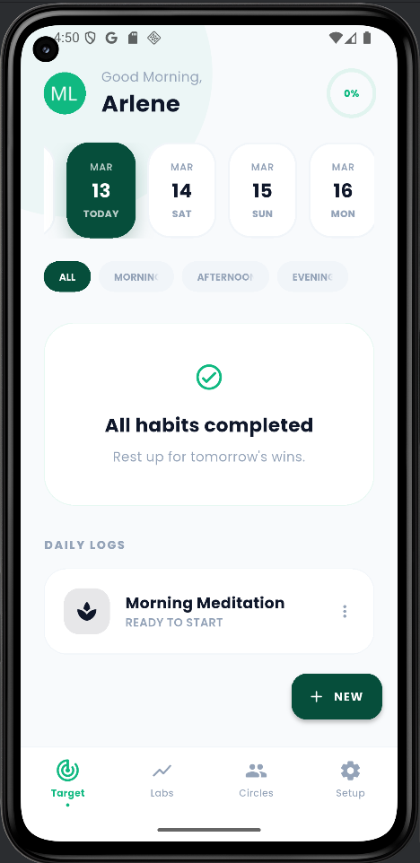
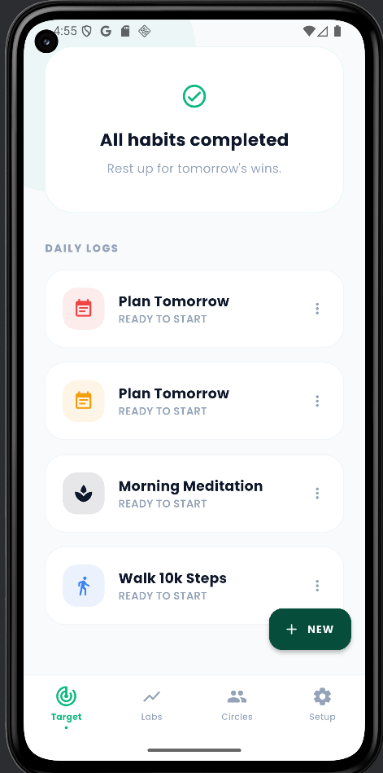
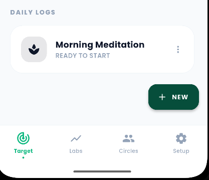
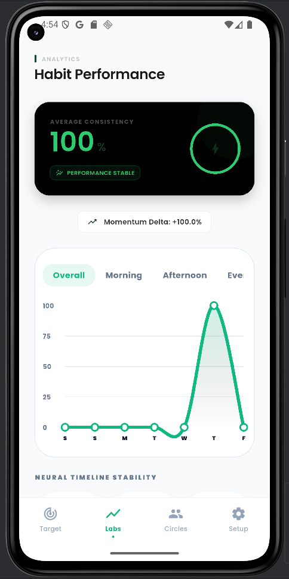

# HabitHero

**HabitHero** is a cross-platform mobile habit tracker for Android and iOS, built with Flutter. The app helps users form long-term routines by logging daily habits, tracking completion streaks, and providing motivational quotes.

- Habit creation and categorization (Health, Study, Fitness, etc.)
- Daily check-in system for consistent follow-through
- Streak and progress analytics for user motivation
- Offline capability with local SQLite storage, plus optional online quote API
- Simple, accessible UI designed for quick interactions and low friction

---

## Project Overview

HabitHero helps users:

- Create and manage personal habits
- Log and review daily completions
- Track consecutive streaks and historical performance
- Receive motivational quotes from a remote API
- Store data offline with SQLite for persistence

The app is developed for the **Advance Mobile Application Development** course and showcases Flutter, local persistence, API integration, and collaborative team development.

---

## Team Members

- ROLLORATA, ARLENE V. - Senior Full Stack
- RANQUE, CHRISTIAN VILLE M. - Quality Assurance
- CAÑEDO, ALBERT JHUN P. - Quality Assurance
- PUSTA, STEPHEN D. - Project Manager
- PAJA, JOHN MARK R. - Junior Full Stack
- SORIANO, MARL LAURENCE A. - Junior Full Stack
- SERRANO, JOSHUA S. - Junior Full Stack

---

## Implementation Summary

1. Flutter architecture: UI in `lib/screens`, widgets in `lib/components`, services in `lib/services`, models in `lib/models`.
2. Data persistence: Local storage using `sqflite` + an SQLite database for habits and history.
3. Habit management: add, edit, delete habits; each habit has name, goal, frequency, and completion stats.
4. Progress tracking: daily check-ins for habit completion and streak computation.
5. Motivational Quotes API: fetches and displays a quote on the home page (online mode only).
6. Offline behavior: app works without internet for habit data; quotes use cached or offline fallback message when fetch fails.

---

## Detailed Implementation

- Habit model (`Habit`): id, title, description, type, targetDays, currentStreak, bestStreak, lastCompletedDate.
- DailyLog model (`DailyLog`): id, habitId, date, isCompleted.
- Quote model (`Quote`): text, author, fetchedAt.
- Database service (`lib/services/db_service.dart`): includes `initializeDB()`, `createHabit()`, `updateHabit()`, `deleteHabit()`, `getHabits()`, `logCompletion()`, `getStreaks()`.
- API service (`lib/services/api_service.dart`): `fetchMotivationalQuote()` with error-handling and local fallback.
- Controllers (`lib/controllers`): state management with `ChangeNotifier` for habit list updates, streak recalculation, and API quote refresh.
- Feature flow:
  - Add habit → store in `habits` table.
  - Complete habit today → insert in `daily_logs` then update habit streak.
  - Fetch streaks via DB query: `SELECT COUNT(*) FROM daily_logs WHERE habitId=? AND date BETWEEN ? AND ?`.
  - Display quotes on Home screen and refresh by pull-to-refresh.

---

## Screenshots

> Add actual images in `assets/screenshots/` and update paths below:

- 
- 
- 
- 

---

## Folder Structure

```
lib/
  main.dart
  components/      # Reusable UI controls
  controllers/     # State handlers and logic
  models/          # Data models (Habit, History, Quote)
  screens/         # App pages (Home, Habits List, Stats)
  services/        # API + DB services
assets/
  habits.json      # initial dataset sample
```

---

## Tech Stack

- Flutter (UI toolkit)  
- Dart (programming language)  
- SQLite via `sqflite` (local data storage)  
- HTTP package for API calls (`http`)  
- State management: `Provider` or `ChangeNotifier` pattern  
- Git/GitHub (collaborative version control)

---

## Setup

### 1. Install required tools

- Flutter SDK: https://flutter.dev/docs/get-started/install (include PATH setup)
- Android Studio:
  - Android SDK, emulator images
  - Flutter and Dart plugins
- VS Code (optional): Flutter and Dart extensions

### 2. Verify your environment

```bash
flutter doctor
```

Fix issues reported by `flutter doctor` (e.g., missing platforms or licenses).

### 3. Get project dependencies

```bash
cd C:\Users\arlen\OneDrive\Documents\ITMSD\HabitHero_Final\HabitHero
flutter pub get
```

### 4. Configure device/emulator

- Run `flutter devices` to list available targets.
- Launch emulator or connect physical device.

---

## Run (Development)

```bash
flutter clean
flutter pub get
flutter run
```

For a specific device/emulator:

```bash
flutter run -d <deviceId>
```

---

## Build APK (Android)

```bash
flutter build apk --release
```

---

## Testing

```bash
flutter test
```

---

## Notes & Troubleshooting

- If you see dependency errors, run `flutter pub get` again and restart your IDE.
- If a DB migration issue appears after updates, uninstall and reinstall the app to reset local storage.
- For API/quote fetch errors, verify device/emulator internet access.

---

## Contributions and Workflow

1. Branch off `develop` for each feature or bugfix
2. Create PR with description and linked issue
3. Code review, then merge into `develop`
4. Final candidate merge into `main` once stabilized

